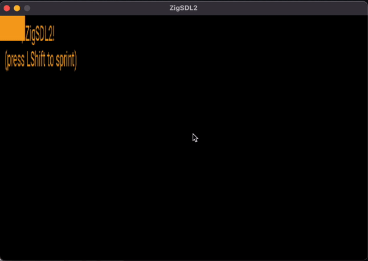

# SDL2 Zig Demo

This repository contains an updated version of the SDL2 Zig Demo created by @andrewrk. The original repository can be found [here](https://github.com/andrewrk/sdl-zig-demo).

## Demo

Check out the demo of the SDL2 Zig Demo in action:



The demo showcases a simple application window created using SDL2 in Zig. The window allows user interaction and displays a red square that can be moved using arrow keys. Additionally, it renders text on the window to display information such as the position and speed of the square.

## How to Build and Run

To build and run the SDL2 Zig Demo, follow these steps:

1. Clone the repository:

```bash
git clone https://github.com/adia-dev/sdl2-zig-demo.git
```


2. Change into the project directory:

```bash
cd sdl2-zig-demo
```

3. Build the project:

```bash
zig build run
```

This will compile the code and execute the resulting binary, launching the SDL2 Zig Demo window.

## Prerequisites

Before running the SDL2 Zig Demo, make sure you have the following dependencies installed:

- Zig compiler (version 0.11 or later (the one the project was built with: `0.11.0-dev.3384+00ff65357`))
- SDL2 development libraries

Ensure that you have the necessary dependencies installed before attempting to build and run the demo.

## Contributing

Contributions are welcome! If you find any issues or have suggestions for improvements, feel free to open an issue or submit a pull request.
